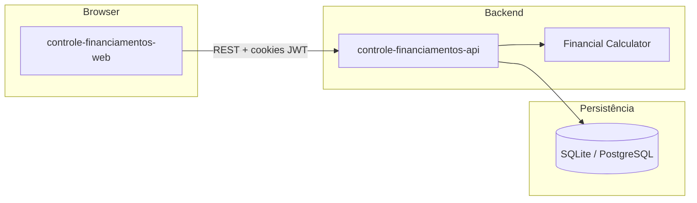

# Simas Quita

Controle de financiamentos veiculares sem planilha — acompanhe parcelas, amortizações, economia de juros e previsão de quitação com cálculos **PRICE/SAC** calibrados por valores reais do banco.

Monorepo **pnpm + Nx** com API NestJS, SPA React e motor financeiro no backend.

---

## O que dá pra fazer

| Área | Recursos |
|------|----------|
| **Conta** | Cadastro, login, sessão JWT (access + refresh em cookies HttpOnly) |
| **Financiamentos** | Wizard de criação, múltiplos veículos, alternância de foco |
| **Parcelas** | Grade automática, filtros, marcar paga, editar e excluir |
| **Amortizações** | Redução de prazo ou parcela, valor bancário opcional por operação |
| **Dashboard** | KPIs, gráficos (Recharts), insights de progresso e economia |
| **Precisão** | Valor informado pelo banco tem prioridade sobre estimativas |

---

## Stack

| Camada | Tecnologias |
|--------|-------------|
| **Frontend** | React 19, Vite, React Router, TanStack Query, Tailwind, shadcn/ui, Recharts |
| **Backend** | NestJS, Prisma, Passport JWT, Pino |
| **Banco** | SQLite (dev local) · PostgreSQL (Docker / produção) |
| **Qualidade** | Vitest, Playwright, ESLint, Nx cache |

---

## Estrutura do monorepo

```
simas-quita/
├── apps/
│   ├── backends/controle-financiamentos-api/   # API REST NestJS
│   ├── frontends/controle-financiamentos-web/  # SPA Vite + React
│   └── controle-financiamentos-e2e/            # Testes E2E (Playwright)
├── libs/
│   └── shared-financing-types/                 # Tipos compartilhados
├── docker-compose.yml                          # Postgres + API + Web
└── tasks/                                      # PRD e specs de implementação
```

---

## Pré-requisitos

- **Node.js** 20+
- **pnpm** 10 (`corepack enable && corepack prepare pnpm@10.17.0 --activate`)
- Ferramentas nativas para `better-sqlite3` e `bcrypt` (build-essential no Linux)

---

## Desenvolvimento local

### 1. Instalar dependências

```bash
pnpm install
```

### 2. Configurar variáveis de ambiente

```bash
cp .env.example .env
```

Ajuste os secrets JWT em produção. Valores padrão para dev:

| Variável | Descrição |
|----------|-----------|
| `DATABASE_URL` | SQLite local (`file:./prisma/dev.db`) |
| `JWT_ACCESS_SECRET` / `JWT_REFRESH_SECRET` | Secrets dos tokens |
| `CORS_ORIGIN` | Origem do frontend (`http://localhost:5173`) |
| `PORT` | Porta da API (`3001`) |
| `VITE_API_URL` | URL base da API para o frontend |

### 3. Banco de dados

```bash
pnpm prisma:generate
pnpm prisma:migrate
```

### 4. Subir API + frontend

```bash
pnpm dev
```

| Serviço | URL |
|---------|-----|
| Frontend | http://localhost:5173 |
| API | http://localhost:3001/api/v1 |
| Health check | http://localhost:3001/health |

Comandos individuais:

```bash
pnpm dev:api   # só a API
pnpm dev:web   # só o frontend
```

---

## Docker (produção local)

Stack completa com PostgreSQL:

```bash
docker compose up --build
```

| Serviço | URL |
|---------|-----|
| Frontend | http://localhost:8080 |
| API | http://localhost:3000/api/v1 |
| PostgreSQL | `localhost:5432` (user/pass/db: `controle`) |

Defina `JWT_ACCESS_SECRET` e `JWT_REFRESH_SECRET` no ambiente antes de subir em produção real.

---

## Scripts úteis

```bash
pnpm build          # build de todos os projetos
pnpm test           # testes unitários (Vitest)
pnpm lint           # ESLint em todo o monorepo
pnpm e2e            # testes E2E (Playwright)
pnpm prisma:generate
pnpm prisma:migrate
```

---

## Arquitetura (visão geral)



O frontend consome a API via React Query. Cálculos financeiros (PRICE/SAC, amortizações, KPIs) rodam no backend para garantir determinismo e recálculo consistente a cada mutação.

---

## Projetos Nx

| Projeto | Descrição |
|---------|-----------|
| `controle-financiamentos-api` | API NestJS |
| `controle-financiamentos-web` | SPA React |
| `controle-financiamentos-e2e` | Playwright |
| `shared-financing-types` | Tipos compartilhados |

Listar targets de um projeto:

```bash
pnpm exec nx show project controle-financiamentos-api
```

---

## Licença

Projeto privado — uso interno.
